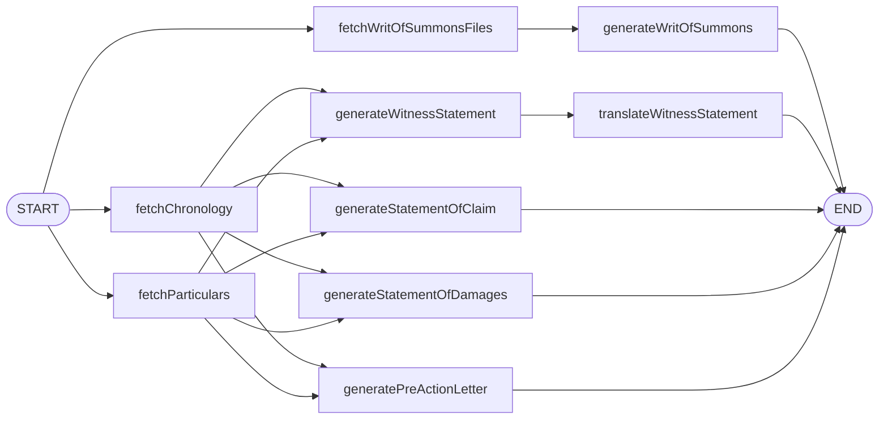

# Vakil

> **An AI paralegal that drafts while you strategize.**

Vakil turns case evidence into court-ready first drafts. Upload PDFs, the app OCRs them, generates particulars and a chronology, then fans out into a Writ of Summons, Statement of Claim, Statement of Damages, Pre-Action Letter, and Witness Statement — with a Bangla (বাংলা) translation of the witness statement.

---

## What this demonstrates

A self-contained, portfolio-grade Next.js 15 application with a meaningful multi-agent backend:

- **Multi-agent orchestration with LangGraph** — a typed `StateGraph` whose topology mirrors actual data dependencies. Three DB fetches fan out in parallel from `START`. Five document generators fan out once particulars + chronology are ready. Witness translation depends on the witness statement. End-to-end wall-time on the generation pass drops substantially vs the original sequential `for`-loop orchestrator. See `lib/graph/graphs/documents.ts`.
- **Production-pattern JWT auth** — 15-minute access JWT signed with [`jose`](https://github.com/panva/jose) (Edge-compatible), 7-day rotating refresh token stored hashed (SHA-256) in the database, bcrypt password hashing, refresh-token reuse detection. Hand-written under `lib/auth/`. No external auth provider.
- **Prisma + SQLite, fully tested** — service layer is a thin Prisma wrapper, each method covered by Vitest unit tests against a real SQLite test database. Schema in `prisma/schema.prisma`.
- **Google Gemini direct** — `lib/llm/index.ts` and `lib/graph/llm.ts` use `@google/genai`. No proxy, no third-party LLM gateway.
- **Mistral OCR** — `lib/ocr/index.ts` for evidence PDFs.
- **Demo-ready** — `npm run prisma:seed` populates one demo user and one fully-populated case, so the app is immediately useful on first run.

## Architecture



Per-document graphs (`particularsGraph`, `chronologyGraph`) wrap each generation in a `generate → verify-markdown → save` loop with declarative retry on invalid output (max 3 attempts) via `addConditionalEdges`.

## Run locally

```bash
git clone https://github.com/orvian36/vakil.git
cd vakil

cp .env.example .env
# Fill at minimum:
#   JWT_ACCESS_SECRET  — any 32+ char random string
#   GEMINI_API_KEY     — from https://aistudio.google.com/

npm install
npm run prisma:migrate     # apply migrations, create prisma/dev.db
npm run prisma:seed        # populate the demo user + case
npm run dev
```

Open <http://localhost:3000> and sign in:

| Email | Password |
|---|---|
| `demo@vakil.app` | `demo1234` |

You'll land on the dashboard with one pre-populated case ("Khan v. Pacific Logistics Ltd."). Open it, walk through the wizard, view all five generated documents in the Review step, and toggle the Witness Statement to **বাংলা**.

> Live OCR additionally needs `MISTRAL_API_KEY` and `DO_SPACES_*` (S3-compatible object store). The seeded demo case bypasses both — its OCR text is pre-populated so reviewers can experience the full flow without any of those credentials.

## Stack

Next.js 15 (App Router) · React 19 · TypeScript · Tailwind v4 · Prisma · SQLite · LangGraph · `@google/genai` · `jose` · `bcryptjs` · Vitest · Mistral OCR · DigitalOcean Spaces

## Tests

```bash
npm test            # vitest run (32 tests across 11 files)
npm run test:watch
npm run test:cov
```

Coverage focuses on the security-critical and integration-heavy paths:

- `lib/auth/password` — bcrypt round-trip
- `lib/auth/tokens` — JWT sign/verify, refresh-token mint, rotation, reuse detection, expiry, mass revoke
- `app/api/auth/*` — register → login → refresh → logout integration
- `services/*` — every Prisma service method against a real SQLite test DB
- `lib/graph/graphs/documents` — full LangGraph DAG end-to-end with a mocked LLM, asserts every field lands on `SocAnalysis`

UI components and seed scripts have no unit tests — verified by `npm run build`, `npm run dev`, and the demo seed.

## Project tour

| Where | What |
|---|---|
| `prisma/schema.prisma` | All tables — `User`, `RefreshToken`, `Case`, `CaseParty`, `File`, `CaseAnalysis`, `SocAnalysis`, `CaseEvidenceType` |
| `lib/auth/` | JWT (jose), refresh-token rotation, password hashing, server session helper |
| `lib/db.ts` | Cached `PrismaClient` (HMR-safe) |
| `lib/llm/index.ts` | Direct Google Gemini client |
| `lib/graph/` | LangGraph nodes, graphs, SSE adapter, debug dumper |
| `lib/prompts/*.txt` | Per-document generation prompts (loaded at request time) |
| `services/*.ts` | Thin Prisma wrappers, one class per table |
| `app/api/auth/*` | `register`, `login`, `refresh`, `logout`, `me` |
| `app/api/orchestration/route.ts` | SSE-streamed orchestration trigger that runs `documentsGraph` |
| `app/case/[case_id]/page.tsx` | 5-step drafting wizard |
| `components/tabs/*.tsx` | Document tabs (Writ · Witness · SoC · SoD · Pre-Action), Witness has an English / বাংলা toggle |
| `middleware.ts` | JWT-gated route middleware (Edge-safe via jose) |
| `config/tabs.json` | Drives the document-tab generator |

## What I'd build next

- **Vercel deployment** with Turso (libSQL) replacing local SQLite — `libsql` speaks the same query syntax, so the Prisma swap is a driver adapter change.
- **Email verification + password reset** via Resend.
- **OAuth (Google)** via Auth.js, sharing the existing `User`/`RefreshToken` tables.
- **Per-case sharing** so multiple paralegals on the same matter can collaborate.
- **OCR queue worker** so wizard step 2 doesn't block the UI on large PDFs.
- **Polish the remaining wizard step internals + modals** — Phase 5 of the rebrand stopped at the dashboard/auth/wizard-shell because the step internals are deep components; their interior color palette still uses the pre-rebrand blue/gray.

## Repo history

This repo was built across six PRs ([#1](https://github.com/orvian36/vakil/pull/1)–[#6](https://github.com/orvian36/vakil/pull/6)), each one a discrete phase: Prisma migration → JWT auth + Gemini → LangGraph orchestration → Bengali + brand → UI design system → demo seed + this README. The planning docs that drove the work live under `docs/superpowers/`.

## License

MIT. Built by [Habibur Rahman](https://github.com/orvian36).
