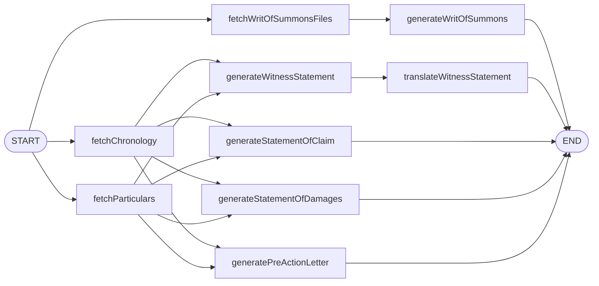

# Phase 6 — Demo seed + portfolio README

> **For agentic workers:** REQUIRED SUB-SKILL: Use `superpowers:subagent-driven-development` or `superpowers:executing-plans`. Read [`2026-05-17-vakil-rebrand-index.md`](./2026-05-17-vakil-rebrand-index.md).

**Pre-requisite:** Phase 5 PR merged. The app looks like Vakil. Screenshots are captured under `docs/screenshots/`.

**Goal:** Make the repo demo-ready. A reviewer should be able to clone, install, seed, run, and immediately experience a populated app with one canonical demo user. The README should sell what the project demonstrates in under 90 seconds of reading.

**Architecture:** Two artefacts. `prisma/seed.ts` becomes a real fixture (one user, one fully-populated case with OCR + all five generated documents + a Bengali translation). `README.md` becomes the portfolio cover.

---

## File Structure

**Modified:**
- `prisma/seed.ts` — full fixture (replaces the smoke version from Phase 1)
- `README.md` — new portfolio README
- `package.json` — confirm `prisma:seed` is wired in (was set in Phase 1)

**Created:**
- `prisma/fixtures/witness_statement.md` — sample English witness statement (~600 words)
- `prisma/fixtures/witness_statement_bn.md` — Bangla translation of the above
- `prisma/fixtures/particulars.md` — sample particulars
- `prisma/fixtures/chronology.md` — sample chronology
- `prisma/fixtures/writ_of_summons.md`, `statement_of_claim.md`, `statement_of_damages.md`, `pre_action_letter.md`
- `prisma/fixtures/ocr_<n>.md` × 3 — fake OCR'd evidence

(Keeping fixtures as standalone files instead of inlining 4kB strings in `seed.ts` keeps the seed readable.)

---

## Task 1: Branch

- [ ] `git checkout main && git pull origin main && git status` (clean)
- [ ] `git checkout -b feat/phase-6-demo-readme`

---

## Task 2: Write the fixture files

These are deliberately *plausible* legal text, not authentic legal documents. The goal is "looks real enough that the demo is engaging" not "could be filed at a courthouse".

- [ ] **Step 1: `prisma/fixtures/ocr_medical.md`** — sample OCR of a medical report. Include: hospital name, patient name (Aarav Khan), incident date (e.g. 2025-08-14), diagnosis, treatment summary. ~300 words.

- [ ] **Step 2: `prisma/fixtures/ocr_police.md`** — sample police incident report. Date, location, parties, brief narrative.

- [ ] **Step 3: `prisma/fixtures/ocr_employer.md`** — letter from employer confirming loss of work days.

- [ ] **Step 4: `prisma/fixtures/particulars.md`** — Markdown particulars document. Headings for "Injury", "Loss of Earnings", "Medical Expenses", "Future Treatment", "Pain & Suffering". Reference the OCR'd evidence.

- [ ] **Step 5: `prisma/fixtures/chronology.md`** — table or list with dates from the OCR'd evidence.

- [ ] **Step 6: `prisma/fixtures/writ_of_summons.md`** — generic Writ template body. Parties block, brief endorsement.

- [ ] **Step 7: `prisma/fixtures/statement_of_claim.md`** — numbered paragraphs referencing the chronology.

- [ ] **Step 8: `prisma/fixtures/statement_of_damages.md`** — itemised damages with amounts.

- [ ] **Step 9: `prisma/fixtures/pre_action_letter.md`** — letter form, addressed to defendant's insurer.

- [ ] **Step 10: `prisma/fixtures/witness_statement.md`** — first-person account, ~500 words, signed block at the end.

- [ ] **Step 11: `prisma/fixtures/witness_statement_bn.md`** — Bangla translation of the above. (Use a translator or hand-write — close-to-literal is fine; this is a fixture.)

- [ ] **Step 12: Commit**

```bash
git add prisma/fixtures/
git commit -m "chore(seed): add markdown fixtures for the demo case"
```

---

## Task 3: Rewrite `prisma/seed.ts` as the full fixture

- [ ] **Step 1: Replace the smoke seed**

```ts
// prisma/seed.ts
import { prisma } from "@/lib/db";
import { hashPassword } from "@/lib/auth/password";
import { readFileSync } from "node:fs";
import path from "node:path";

const F = (name: string) => readFileSync(path.join(process.cwd(), "prisma", "fixtures", name), "utf-8");

async function main() {
  // 1. Demo user
  const email = "demo@vakil.app";
  const passwordHash = await hashPassword("demo1234");

  const user = await prisma.user.upsert({
    where: { email },
    create: { email, passwordHash, name: "Demo Lawyer" },
    update: { passwordHash, name: "Demo Lawyer" },
  });

  // 2. Wipe the demo user's existing case data so seeding is idempotent
  const oldCases = await prisma.case.findMany({ where: { userId: user.id }, select: { id: true } });
  if (oldCases.length) {
    await prisma.case.deleteMany({ where: { id: { in: oldCases.map((c) => c.id) } } });
  }

  // 3. Demo case
  const demoCase = await prisma.case.create({
    data: {
      userId: user.id,
      title: "Khan v. Pacific Logistics Ltd.",
      summary: "Personal injury claim arising from a workplace forklift incident on 14 August 2025.",
      caseType: "SOC",
      court: "High Court",
      caseNumber: "HCPI-2025-1842",
      parties: {
        create: [
          { name: "Aarav Khan",           bengaliName: "আরভ খান",         role: "plaintiff", type: "person"  },
          { name: "Pacific Logistics Ltd.", bengaliName: null,            role: "defendant", type: "company" },
        ],
      },
      evidenceTypes: {
        create: defaultEvidenceTypes(),
      },
    },
  });

  // 4. Evidence files (with OCR pre-filled — no live OCR call needed)
  const files = [
    { id: "demo-file-medical", fileName: "medical_report.pdf", type: "medical_records", ocr: F("ocr_medical.md") },
    { id: "demo-file-police",  fileName: "police_report.pdf",  type: "police_reports",  ocr: F("ocr_police.md")  },
    { id: "demo-file-employer",fileName: "employer_letter.pdf",type: "employment_income",ocr: F("ocr_employer.md") },
  ];
  for (const f of files) {
    await prisma.file.create({
      data: {
        id: f.id,
        caseId: demoCase.id,
        type: f.type,
        fileName: f.fileName,
        fileKey: `demo/${f.id}.pdf`,
        processingStatus: "completed",
        ocrData: f.ocr,
        summary: f.ocr.split("\n").slice(0, 2).join(" ").slice(0, 200),
      },
    });
  }

  // 5. SOC analysis row populated with every generated document
  const ca = await prisma.caseAnalysis.create({
    data: { caseId: demoCase.id, analysisType: "soc", analysisStatus: "completed" },
  });

  await prisma.socAnalysis.create({
    data: {
      caseAnalysisId: ca.id,
      allFileOcr:                files.map((f) => f.ocr).join("\n\n"),
      particularsMarkdown:       F("particulars.md"),
      chronologyMarkdown:        F("chronology.md"),
      writOfSummons:             F("writ_of_summons.md"),
      statementOfClaim:          F("statement_of_claim.md"),
      statementOfDamages:        F("statement_of_damages.md"),
      preActionLetter:           F("pre_action_letter.md"),
      witnessStatement:          F("witness_statement.md"),
      witnessStatementBengali:   F("witness_statement_bn.md"),
    },
  });

  console.log("Seeded:");
  console.log("  User:    demo@vakil.app / demo1234");
  console.log("  Case:    " + demoCase.title);
  console.log("  Files:   " + files.length);
}

function defaultEvidenceTypes() {
  // Mirror EvidenceTypeService.getDefaultEvidenceTypes() — duplicating here to
  // avoid importing services from seed (services depend on lib/db, which is fine,
  // but the import path can be brittle at seed time).
  return [
    { key: "writ_of_summons_supporting", title: "Writ of Summons supporting documents", description: "Supporting documents for the writ of summons", isDefault: true, displayOrder: 1 },
    { key: "medical_records",            title: "Medical Records & Reports",            description: "Hospital/clinic records, doctor's certificates",     isDefault: true, displayOrder: 2 },
    { key: "medical_bills",              title: "Medical Bills & Receipts",             description: "Consultations, medication, rehabilitation",          isDefault: true, displayOrder: 3 },
    { key: "police_reports",             title: "Police / Incident Reports",            description: "Management or police incident reports",              isDefault: true, displayOrder: 4 },
    { key: "witness_statements",         title: "Witness Statements",                   description: "Written accounts from people who saw the incident",  isDefault: true, displayOrder: 5 },
    { key: "employment_income",          title: "Employment & Income Proof",            description: "Payslips, employer's letter",                        isDefault: true, displayOrder: 6 },
    { key: "transportation_receipts",    title: "Transportation Receipts",              description: "Travel to/from medical appointments",                isDefault: true, displayOrder: 7 },
    { key: "damaged_property",           title: "Damaged Property Evidence",            description: "Photos and receipts for damaged personal items",     isDefault: true, displayOrder: 8 },
    { key: "future_treatment",           title: "Future Treatment Estimates",           description: "Medical quotes for future treatment",                isDefault: true, displayOrder: 9 },
    { key: "correspondence",             title: "Correspondence",                       description: "Letters, emails, messages with the other party",     isDefault: true, displayOrder: 10 },
  ];
}

main()
  .then(() => prisma.$disconnect())
  .catch((e) => {
    console.error(e);
    return prisma.$disconnect().then(() => process.exit(1));
  });
```

- [ ] **Step 2: Run it**

```bash
npm run prisma:seed
```

Expected: prints the demo credentials and counts.

- [ ] **Step 3: Sanity check via Prisma Studio**

```bash
npm run prisma:studio
```

Verify: 1 `User`, 1 `Case`, 2 `CaseParty` rows, 3 `File` rows (all `completed`), 1 `CaseAnalysis`, 1 `SocAnalysis` with every field populated.

- [ ] **Step 4: Sign in as the demo user**

```bash
npm run dev
```

Sign in at `/login` with `demo@vakil.app` / `demo1234`. Confirm the case is on the dashboard, click through, see all 5 documents pre-rendered, toggle the Witness Statement to বাংলা.

- [ ] **Step 5: Commit**

```bash
git add prisma/seed.ts
git commit -m "chore(seed): full demo user + populated case fixture"
```

---

## Task 4: Re-capture screenshots if anything looks off

Phase 5 already captured `docs/screenshots/`. With the seeded data the dashboard and tabs now have real content — re-take those screenshots if the previous ones were taken against an empty/demo-less state.

- [ ] **Step 1: Capture / replace**

Same names, same locations.

- [ ] **Step 2: Commit (if changed)**

```bash
git add docs/screenshots/
git commit -m "docs: refresh screenshots with seeded demo data"
```

---

## Task 5: Write the portfolio README

Replace any existing `README.md` (likely Next.js boilerplate or absent).

- [ ] **Step 1: Write `README.md`**

```markdown
# Vakil

> An AI paralegal that drafts while you strategize.

Vakil turns case evidence into court-ready first drafts. Upload PDFs, the app OCRs them, generates particulars and a chronology, then fans out into a Writ of Summons, Statement of Claim, Statement of Damages, Pre-Action Letter, and Witness Statement — with a Bangla (বাংলা) translation of the witness statement.


## What this demonstrates

- **Multi-agent orchestration with LangGraph.** A typed `StateGraph` with parallel fan-out — three DB fetches run concurrently, five document generators run concurrently after particulars and chronology are ready, then translation runs as a dependent terminal node. See `lib/graph/graphs/documents.ts`.
- **Production-pattern JWT auth.** 15-min access JWT + 7-day rotating refresh token, bcrypt password hashing, refresh-token re-use detection. Hand-written in `lib/auth/`. No external auth provider.
- **Prisma + SQLite, fully tested.** Service layer is thin, with Vitest unit tests covering every CRUD path. Schema in `prisma/schema.prisma`.
- **Google Gemini direct.** `lib/llm/index.ts` and `lib/graph/llm.ts` use `@google/genai` — no proxy, no third-party LLM gateway.
- **Mistral OCR.** `lib/ocr/index.ts` for evidence PDFs.
- **Demo-ready.** One npm script seeds a fully populated case so the app is immediately useful on first run.

## Architecture



## Run locally

```bash
git clone https://github.com/orvian36/vakil.git
cd vakil
cp .env.example .env
# fill in JWT_ACCESS_SECRET and GEMINI_API_KEY at minimum
npm install
npm run prisma:migrate
npm run prisma:seed
npm run dev
```

Open http://localhost:3000 and sign in:

| Email | Password |
|---|---|
| `demo@vakil.app` | `demo1234` |

You'll land on the dashboard with one pre-populated case. Open it, walk through the wizard, view all five generated documents in the Review step, and toggle the Witness Statement to বাংলা.

## Stack

Next.js 15 (App Router) · React 19 · TypeScript · Tailwind v4 · Prisma · SQLite · LangGraph · `@google/genai` · `bcryptjs` · `jsonwebtoken` · Vitest · Mistral OCR · DigitalOcean Spaces (S3-compatible storage)

## Tests

```bash
npm test            # vitest run
npm run test:watch
npm run test:cov
```

Tests cover auth (password hashing, token rotation, full register→login→refresh→logout flow), every Prisma service, and an integration test for the LangGraph documents pipeline.

## Project tour

| Where | What |
|---|---|
| `prisma/schema.prisma` | All tables |
| `lib/auth/` | JWT and refresh-token logic |
| `lib/db.ts` | Cached `PrismaClient` |
| `lib/llm/index.ts` | Direct Gemini client |
| `lib/graph/` | LangGraph nodes, graphs, SSE adapter |
| `lib/prompts/*.txt` | Per-document generation prompts (loaded at request time) |
| `services/*.ts` | Thin Prisma wrappers, one per table |
| `app/api/auth/*` | Auth endpoints |
| `app/api/orchestration/route.ts` | SSE-streamed orchestration trigger |
| `app/case/[case_id]/page.tsx` | 5-step wizard |
| `components/tabs/*.tsx` | Document tabs (Writ, Witness, SoC, SoD, Pre-Action) |
| `components/steps/Step*.tsx` | Wizard steps |
| `middleware.ts` | JWT-gated route middleware |
| `config/tabs.json` | Drives the document-tab generator |

## What I'd build next

- Vercel deployment with Turso (libSQL) replacing the local SQLite.
- Email verification + password reset (Resend or Sendgrid).
- Per-case sharing / collaborative editing.
- A second translation language; the `translateWitnessStatement` node generalises easily.
- Move OCR onto a queue worker so wizard step 2 doesn't block the UI.

## License

MIT. Built by [Habibur Rahman](https://github.com/orvian36).
```

- [ ] **Step 2: Verify the screenshot path renders on GitHub**

After pushing, the `docs/screenshots/02-dashboard.png` reference in the README needs to point at an actually-committed file. Confirm the file exists:

```bash
ls docs/screenshots/02-dashboard.png
```

- [ ] **Step 3: Commit**

```bash
git add README.md
git commit -m "docs: portfolio README with arch diagram, screenshots, run guide"
```

---

## Task 6: Final-final verification

- [ ] **Step 1: Fresh-clone simulation**

In a scratch directory:

```bash
cd /tmp   # or any directory outside the repo
git clone <repo-url> vakil-fresh
cd vakil-fresh
cp .env.example .env
# Fill JWT_ACCESS_SECRET (any 32+ char string) and GEMINI_API_KEY
npm install
npm run prisma:migrate
npm run prisma:seed
npm run dev
```

Open http://localhost:3000 → sign in with demo creds → see the demo case → click in.

If any step fails, fix the underlying issue in the real repo (not the scratch clone) and re-test.

- [ ] **Step 2: Run the full test suite**

```bash
cd <original repo path>
npx tsc --noEmit
npx vitest run
npm run build
```

All three must pass.

- [ ] **Step 3: One last brand sweep**

```bash
grep -rln --include="*.ts" --include="*.tsx" --include="*.json" --include="*.md" --include="*.css" -E "Personal Injury|Makebell|makebell" .
```
Only acceptable matches: `docs/superpowers/specs/` and `docs/superpowers/plans/` (intentional historical references).

---

## Task 7: PR + merge

- [ ] **Step 1: Push**

```bash
git push -u origin feat/phase-6-demo-readme
```

- [ ] **Step 2: PR body** (`docs/superpowers/plans/.pr-body.md`):

```markdown
## Summary

Make the repo demo-ready. `prisma/seed.ts` becomes a real fixture (one demo user, one fully-populated case with OCR + all five generated documents + Bangla witness translation). New portfolio README sells what the project demonstrates.

## Highlights
- One npm script (`prisma:seed`) plus one set of credentials (`demo@vakil.app` / `demo1234`) gets a reviewer to a working app.
- Fixtures live as plain Markdown under `prisma/fixtures/` — easy to read, easy to edit.
- README includes a Mermaid diagram of the LangGraph DAG, a project tour, and "what I'd build next" framing for honest scope.

## Test plan
- [x] `npm run prisma:seed` repeats idempotently (deletes old demo data first).
- [x] Sign in as demo user → full case visible, all tabs populated, English/বাংলা toggle works.
- [x] Fresh-clone simulation in `/tmp` succeeds end-to-end.
- [x] `npm test`, `tsc --noEmit`, `npm run build` all clean.

## Out of scope
Future work itemised in the README's "What I'd build next" section.
```

- [ ] **Step 3: Open, merge, sync**

```bash
gh pr create --base main --head feat/phase-6-demo-readme \
  --title "feat: phase 6 — demo seed + portfolio readme" \
  --body-file docs/superpowers/plans/.pr-body.md
gh pr merge --merge --delete-branch
git checkout main && git pull origin main
```

---

## Task 8: Polish the GitHub repo metadata

- [ ] **Step 1: Update repo description, topics, homepage**

```bash
gh repo edit orvian36/vakil \
  --description "AI paralegal that drafts while you strategize — multi-agent LangGraph pipeline + Prisma + JWT auth, in Next.js 15." \
  --add-topic ai --add-topic langgraph --add-topic nextjs --add-topic prisma --add-topic jwt-authentication --add-topic legal-tech --add-topic typescript
```

- [ ] **Step 2: Pin on profile**

Via GitHub UI: pin `vakil` to your profile.

- [ ] **Step 3: (Optional)** record a Loom or asciinema cast of the wizard flow and link it in the README under the hero image. Skip if you don't have screen-recording set up.

---

**Vakil rebrand complete.** `main` now contains six tagged-by-PR phases of cleanly attributable work, each leaving the app in a runnable state. Total commits on `main`: roughly 60–80 across the six PRs.
