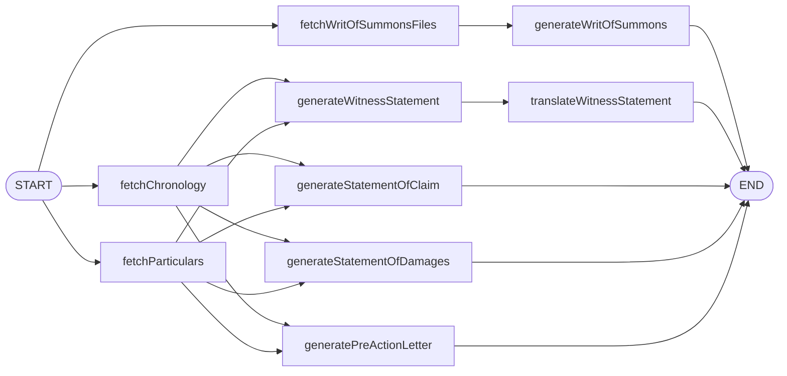

# Recruiter-Facing Repo Polish Implementation Plan

> **For agentic workers:** REQUIRED SUB-SKILL: Use superpowers:subagent-driven-development (recommended) or superpowers:executing-plans to implement this plan task-by-task. Steps use checkbox (`- [ ]`) syntax for tracking.

**Goal:** Restructure `README.md` around an engineering-highlights section and close two repo-hygiene gaps (missing `LICENSE`, no slot for hero visual) so a senior engineer skimming the GitHub link from a CV sees concrete engineering decisions in the first screenful.

**Architecture:** Three file changes at the repo root — replace `README.md` content, create `LICENSE`, create `docs/screenshots/.gitkeep`. No application code is touched. Two commits keep the LICENSE hygiene change separate from the README content rewrite.

**Tech Stack:** Markdown only. Validation uses the existing `npm test` and `npm run build` scripts.

**Reference spec:** `docs/superpowers/specs/2026-05-22-recruiter-repo-polish-design.md`

---

## File Structure

| Path | Action | Responsibility |
|---|---|---|
| `LICENSE` | Create | Standard MIT license text; resolves the gap where README claims MIT but no file exists |
| `docs/screenshots/.gitkeep` | Create | Empty placeholder so the directory exists in git for a future hero screenshot |
| `README.md` | Rewrite | Full replacement; new top-to-bottom structure with badges, at-a-glance, engineering highlights promoted above architecture |

No tests are added — this work is documentation. Validation is "`npm test` and `npm run build` still pass" plus the visual GitHub render check at the end.

---

### Task 1: Verify the real test count

The README badge will display the test count. The current README claims 32 — the implementing engineer must confirm the actual current number before writing the badge, because Task 5 hard-codes it.

**Files:** none modified in this task. The count is captured for use in Task 5.

- [ ] **Step 1: Run the full test suite and note the count**

Run: `npm test`

Expected: all tests pass. The summary line at the end will look like `Tests   N passed (N)` or similar. Note the number `N`.

- [ ] **Step 2: Record the count**

Write the count down. You'll substitute it for `<COUNT>` in the README badge URL in Task 5.

If the suite has any failing tests, **stop and report**. Do not proceed — the README would advertise broken tests.

---

### Task 2: Create the LICENSE file

**Files:**
- Create: `LICENSE`

- [ ] **Step 1: Create the LICENSE file with standard MIT text**

Create `LICENSE` at the repo root with exactly this content:

```
MIT License

Copyright (c) 2026 Habibur Rahman

Permission is hereby granted, free of charge, to any person obtaining a copy
of this software and associated documentation files (the "Software"), to deal
in the Software without restriction, including without limitation the rights
to use, copy, modify, merge, publish, distribute, sublicense, and/or sell
copies of the Software, and to permit persons to whom the Software is
furnished to do so, subject to the following conditions:

The above copyright notice and this permission notice shall be included in all
copies or substantial portions of the Software.

THE SOFTWARE IS PROVIDED "AS IS", WITHOUT WARRANTY OF ANY KIND, EXPRESS OR
IMPLIED, INCLUDING BUT NOT LIMITED TO THE WARRANTIES OF MERCHANTABILITY,
FITNESS FOR A PARTICULAR PURPOSE AND NONINFRINGEMENT. IN NO EVENT SHALL THE
AUTHORS OR COPYRIGHT HOLDERS BE LIABLE FOR ANY CLAIM, DAMAGES OR OTHER
LIABILITY, WHETHER IN AN ACTION OF CONTRACT, TORT OR OTHERWISE, ARISING FROM,
OUT OF OR IN CONNECTION WITH THE SOFTWARE OR THE USE OF OR OTHER DEALINGS IN
THE SOFTWARE.
```

This is the verbatim OSI-approved MIT license template with the copyright line set to `2026 Habibur Rahman` (matches the existing README author credit).

---

### Task 3: Create the screenshots placeholder directory

**Files:**
- Create: `docs/screenshots/.gitkeep`

`docs/screenshots/` will hold the hero screenshot when the user captures it later. Git ignores empty directories, so `.gitkeep` is the standard idiom to commit the folder.

- [ ] **Step 1: Create the directory and empty file**

Create `docs/screenshots/.gitkeep` as an empty file (zero bytes).

On PowerShell:
```powershell
New-Item -ItemType Directory -Force docs/screenshots | Out-Null
if (-not (Test-Path docs/screenshots/.gitkeep)) { New-Item -ItemType File docs/screenshots/.gitkeep | Out-Null }
```

On bash:
```bash
mkdir -p docs/screenshots && touch docs/screenshots/.gitkeep
```

- [ ] **Step 2: Verify the file exists and is empty**

Verify `docs/screenshots/.gitkeep` exists at exactly that path and has 0 bytes.

---

### Task 4: Commit hygiene files

**Files staged:** `LICENSE`, `docs/screenshots/.gitkeep`

- [ ] **Step 1: Stage and commit**

Run (using a HEREDOC so the message formatting survives PowerShell):

```bash
git add LICENSE docs/screenshots/.gitkeep
git commit -m "$(cat <<'EOF'
chore: add LICENSE and screenshots placeholder

MIT LICENSE file resolves a hygiene gap where the README claimed
MIT but no file existed. docs/screenshots/.gitkeep reserves the
folder for the hero screenshot referenced by the rewritten README.

Co-Authored-By: Claude Opus 4.7 <noreply@anthropic.com>
EOF
)"
```

- [ ] **Step 2: Verify the commit landed**

Run: `git log -1 --stat`

Expected: one commit, two files (`LICENSE` and `docs/screenshots/.gitkeep`), `LICENSE` showing `+21` lines (or thereabouts), `.gitkeep` showing `+0 -0`.

---

### Task 5: Rewrite README.md

**Files:**
- Modify: `README.md` (full replacement)

This is the largest task. Replace the entire content of `README.md` with the block below. **Substitute `<COUNT>` with the number from Task 1.** Do not leave the literal `<COUNT>` in the file — that would render as an empty badge.

- [ ] **Step 1: Replace README.md with the new content**

Write the following to `README.md`, with `<COUNT>` replaced by the verified test count:

````markdown
# Vakil

> **An AI paralegal that drafts while you strategize.**


<!-- HERO: drop docs/screenshots/hero.png here when captured -->

Vakil turns case evidence into court-ready first drafts. Upload PDFs, the app OCRs them, generates particulars and a chronology, then fans out into a Writ of Summons, Statement of Claim, Statement of Damages, Pre-Action Letter, and Witness Statement — with a Bangla (বাংলা) translation of the witness statement.

## At a glance

**What:** AI paralegal that turns case PDFs into five court-ready first drafts (Writ of Summons, Statement of Claim, Statement of Damages, Pre-Action Letter, Witness Statement — with a Bangla translation of the witness statement).

**Who for:** Solo and small-firm lawyers in Bangladesh who spend hours producing the same template documents.

**Why it's interesting:** Real multi-agent orchestration (LangGraph DAG, not a chain), hand-written Edge-runtime JWT auth, and a test suite that hits a real database.

## Engineering highlights

1. **Parallel LangGraph DAG for document generation.** Three DB-fetch nodes fan out from `START`; five generators fan out once their inputs land. Replaces a sequential `for`-loop orchestrator — wall-time scales with the slowest branch, not the sum. → `lib/graph/graphs/documents.ts`

2. **Declarative retry on invalid LLM output.** Per-document graphs (`particularsGraph`, `chronologyGraph`) wrap each generation in `generate → verify-markdown → save` with `addConditionalEdges` retrying up to 3× on invalid Markdown. No imperative retry loops in node code. → `lib/graph/graphs/particulars.ts`

3. **Edge-runtime JWT auth, hand-written.** 15-min access JWT signed via `jose` (Edge-compatible — `jsonwebtoken` isn't), 7-day refresh tokens stored hashed (SHA-256), rotation is transactional, reuse of a revoked token returns 401 as a real attack signal. No NextAuth, no third-party provider. → `lib/auth/`, `middleware.ts`

4. **Streaming server events from the graph to the UI.** `documentsGraph.streamEvents(v2)` is mapped to a stable legacy SSE shape so the frontend kept working through the orchestrator rewrite. → `lib/graph/sse.ts`, `app/api/orchestration/route.ts`

5. **Real-DB Vitest, not mocks.** Service-layer + auth-flow tests hit a real SQLite DB; the DAG test runs end-to-end with a mocked LLM and asserts every output column lands on `SocAnalysis`. `fileParallelism: false` because SQLite races the truncate. → `tests/`, `vitest.config.ts`

6. **Config-driven document tabs.** Adding a new generated document = one column on `SocAnalysis`, one prompt file, one graph node, one entry in `config/tabs.json`. The UI doesn't change. → `config/tabs.json`, `components/tabs/`

## Architecture



Per-document graphs (`particularsGraph`, `chronologyGraph`) wrap each generation in a `generate → verify-markdown → save` loop with declarative retry on invalid output (max 3 attempts) via `addConditionalEdges`.

## Run locally

```bash
git clone https://github.com/orvian36/vakil.git
cd vakil

cp .env.example .env
# Fill at minimum:
#   JWT_ACCESS_SECRET  — any 32+ char random string
#   GEMINI_API_KEY     — from https://aistudio.google.com/

npm install
npm run prisma:migrate
npm run prisma:seed
npm run dev
```

Sign in at <http://localhost:3000>:

| Email | Password |
|---|---|
| `demo@vakil.app` | `demo1234` |

The seeded "Khan v. Pacific Logistics Ltd." case is pre-populated with OCR text, so the live OCR credentials (`MISTRAL_API_KEY`, `DO_SPACES_*`) are **not** required to experience the full flow.

## Stack

Next.js 15 (App Router) · React 19 · TypeScript · Tailwind v4 · Prisma · SQLite · LangGraph · `@google/genai` · `jose` · `bcryptjs` · Vitest · Mistral OCR · DigitalOcean Spaces

## Tests

`npm test` runs <COUNT> Vitest tests covering the security-critical and integration-heavy paths:

- `lib/auth/password` — bcrypt round-trip
- `lib/auth/tokens` — JWT sign/verify, refresh-token mint, rotation, reuse detection, expiry, mass revoke
- `app/api/auth/*` — register → login → refresh → logout integration
- `services/*` — every Prisma service method against a real SQLite test DB
- `lib/graph/graphs/documents` — full LangGraph DAG end-to-end with a mocked LLM, asserts every field lands on `SocAnalysis`

UI components and seed scripts have no unit tests — verified by `npm run build`, `npm run dev`, and the demo seed.

## Project tour

| Where | What |
|---|---|
| `prisma/schema.prisma` | All tables — `User`, `RefreshToken`, `Case`, `CaseParty`, `File`, `CaseAnalysis`, `SocAnalysis`, `CaseEvidenceType` |
| `lib/auth/` | JWT (jose), refresh-token rotation, password hashing, server session helper |
| `lib/db.ts` | Cached `PrismaClient` (HMR-safe) |
| `lib/llm/index.ts` | Direct Google Gemini client |
| `lib/graph/` | LangGraph nodes, graphs, SSE adapter, debug dumper |
| `lib/prompts/*.txt` | Per-document generation prompts (loaded at request time) |
| `services/*.ts` | Thin Prisma wrappers, one class per table |
| `app/api/auth/*` | `register`, `login`, `refresh`, `logout`, `me` |
| `app/api/orchestration/route.ts` | SSE-streamed orchestration trigger that runs `documentsGraph` |
| `app/case/[case_id]/page.tsx` | 5-step drafting wizard |
| `components/tabs/*.tsx` | Document tabs (Writ · Witness · SoC · SoD · Pre-Action), Witness has an English / বাংলা toggle |
| `middleware.ts` | JWT-gated route middleware (Edge-safe via jose) |
| `config/tabs.json` | Drives the document-tab generator |

## What I'd build next

- **GitHub Actions CI** running `npm test` + `npm run build` on every push, with a real status badge replacing the static one above.
- **Vercel deployment** with Turso (libSQL) replacing local SQLite — `libsql` speaks the same query syntax, so the Prisma swap is a driver adapter change.
- **Email verification + password reset** via Resend.
- **OAuth (Google)** via Auth.js, sharing the existing `User`/`RefreshToken` tables.
- **Per-case sharing** so multiple paralegals on the same matter can collaborate.
- **OCR queue worker** so wizard step 2 doesn't block the UI on large PDFs.
- **Polish the remaining wizard step internals + modals** — Phase 5 of the rebrand stopped at the dashboard/auth/wizard-shell because the step internals are deep components; their interior color palette still uses the pre-rebrand blue/gray.

## Repo history

This repo was built across six PRs ([#1](https://github.com/orvian36/vakil/pull/1)–[#6](https://github.com/orvian36/vakil/pull/6)), each one a discrete phase: Prisma migration → JWT auth + Gemini → LangGraph orchestration → Bengali + brand → UI design system → demo seed + this README. The planning docs that drove the work live under `docs/superpowers/`.

## License

MIT — see [`LICENSE`](./LICENSE). Built by [Habibur Rahman](https://github.com/orvian36).
````

**Important:** the `<COUNT>` placeholder appears **twice** — once in the badge URL line and once in the Tests section opening sentence. Replace **both** occurrences with the number from Task 1.

- [ ] **Step 2: Verify both `<COUNT>` substitutions are done**

Run: `grep -n "<COUNT>" README.md`

Expected: no output (i.e. zero matches). If grep returns any lines, the placeholder substitution was missed — fix and re-check.

- [ ] **Step 3: Verify the README has no other stale references**

Run: `grep -n "What this demonstrates\|substantially" README.md`

Expected: no output. The old "What this demonstrates" heading and the qualitative-but-still-vague "drops substantially" phrase should both be gone.

---

### Task 6: Run validation

The spec requires `npm run build` to pass after the change. Tests already ran in Task 1, but re-run as a final sanity check (the new README mentions the count, so a regression here would be embarrassing).

**Files:** none modified.

- [ ] **Step 1: Run the production build**

Run: `npm run build`

Expected: exit code 0, "Compiled successfully" or equivalent in the output. If the build fails, **stop** — it would have failed before the README change too (no code was touched), but you'd want to investigate before claiming the polish pass is done.

- [ ] **Step 2: Re-run the test suite**

Run: `npm test`

Expected: same count as Task 1, all passing. If the count changed between Task 1 and now, update the README to match (both occurrences) and re-do Task 5 Step 2.

---

### Task 7: Commit the README rewrite

**Files staged:** `README.md`

- [ ] **Step 1: Stage and commit**

Run:

```bash
git add README.md
git commit -m "$(cat <<'EOF'
docs: restructure README around engineering highlights

Promotes a six-bullet "Engineering highlights" section above the
architecture diagram so a senior engineer skimming from a CV link
sees concrete decisions in the first screenful. Adds shields.io
badges, an "At a glance" summary, and a hero-screenshot placeholder
comment. Trims the second-person prose around the demo creds and
removes the old "What this demonstrates" framing.

Co-Authored-By: Claude Opus 4.7 <noreply@anthropic.com>
EOF
)"
```

- [ ] **Step 2: Verify the commit landed**

Run: `git log -2 --oneline`

Expected: two recent commits — the LICENSE commit from Task 4 and the README commit from this task.

---

### Task 8: Surface the GitHub About-sidebar text to the user

The GitHub repo's About sidebar (description, topics, website) can only be edited through the github.com web UI — not via files in the repo. Surface the paste-ready text so the user can do it manually after pushing.

**Files:** none.

- [ ] **Step 1: Print the paste-ready text to the user**

Output exactly this to the user (do not paraphrase):

> **Paste these into https://github.com/orvian36/vakil → ⚙ (gear icon next to "About"):**
>
> **Description:**
> `AI paralegal that drafts court-ready first drafts from case PDFs. Next.js 15 + LangGraph + Gemini + hand-rolled JWT auth.`
>
> **Topics (comma- or space-separated in the topics input):**
> `nextjs typescript langgraph langchain gemini prisma jwt multi-agent legal-tech rag`
>
> **Website:** leave blank until there's a live demo.
>
> Then push to remote: `git push origin main` — the new README and LICENSE will appear on the repo page, and GitHub will auto-detect the MIT license in the "About" sidebar.

- [ ] **Step 2: Final summary**

Report to the user:
- LICENSE added.
- `docs/screenshots/` reserved for the hero visual (still TODO on their side).
- README restructured: badges + at-a-glance + engineering highlights → architecture → setup → stack → tests → tour → roadmap → history → license.
- Test count in the badge: `<COUNT>` (substitute the real number).
- Two commits made locally; user needs to `git push` and paste the About-sidebar text manually.

---

## Self-Review

Ran against the spec:

**1. Spec coverage:** Every deliverable in the spec is implemented by a task —
   - Spec §1 (rewritten README) → Task 5
   - Spec §1.1 (badges) → Task 5 (badge block at top) + Task 1 (real test count)
   - Spec §1.2 (six bullets) → Task 5 (verbatim from spec)
   - Spec §1.3 (at-a-glance) → Task 5 (verbatim from spec)
   - Spec §2 (LICENSE) → Task 2
   - Spec §3 (screenshots placeholder) → Task 3
   - Spec §4 (About sidebar) → Task 8
   - Spec "Validation" → Task 1 (real test count) + Task 6 (build + re-run tests)

**2. Placeholder scan:** Only intentional placeholder is `<COUNT>` in Task 5, with explicit substitution instructions in Step 1 and a verification grep in Step 2. No TBDs, no "TODO later", no "similar to Task N". ✓

**3. Type consistency:** No code types in this plan (it's a docs change). File paths are consistent: `LICENSE`, `docs/screenshots/.gitkeep`, `README.md` appear identically wherever referenced. ✓

**4. One additional fix:** Task 5 Step 3 added a `grep` for `"What this demonstrates|substantially"` to catch the case where a careless engineer pastes the new README on top of fragments of the old one. The spec required the section to be deleted; this verifies it.
